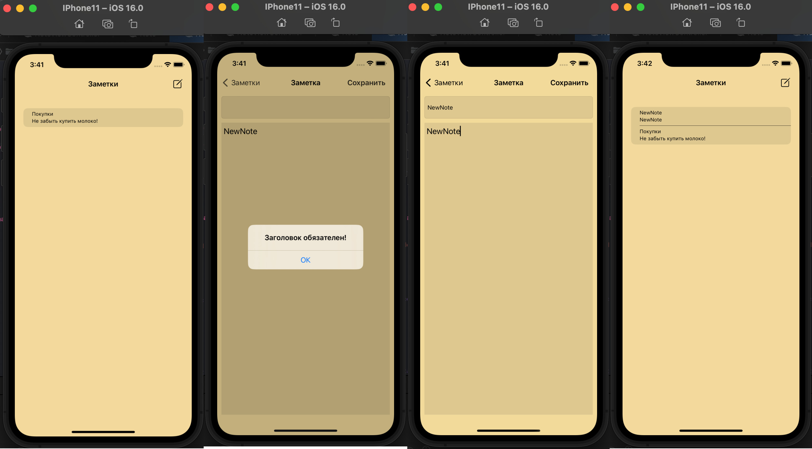

# Notes
Приложение для заметок на языке программирования Swift. 

## Описаний технологий
Проект был создан с использованием Xcode 14.0.1, Swift 5.7, IOS 16.0. Паттерн MVC. Для хранения данных используется UserDefaults.

## Описание приложения
Функционал приложения:
* создание и удаление заметок, а также их вывод списком в приложении;
* возможность реадктирования любой заметки в собственном окне;
* сохранение всех заметок между сеансами;
* при первом запуске прилжение имеет одну заметку.

## Скриншоты

